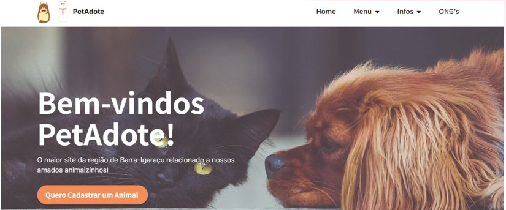

# Meus Aprendizados

👋 Bem-vindos ao meu projetinho!

Atualmente ele se encontra em Fase inicial de Desenvolvimento

**Qual o tema do projeto e sua inspiração? 🐾**

Esse projeto é fortemente inspirado em minha Iniciação Cientifica realizada na faculdade, em que seu objetivo era:
• Divulgar em um Website, de forma centralizada, adoção, pedidos de resgate, animais perdidos, ONG’s e indivíduos que trabalham em prol da causa animal da região de Igaraçu-Barra Bonita. 

Com o tema em mente, meu objetivo nesse projeto é reformular a ideia pensada anteriormente e juntamente aplicar meus conhecimentos adquiridos na área.

**O que contem atualmente?**

⬛DDD

⬛CQRS

⬛Docker

⬛Agregados

⬛UnitOfWork Pattern

**O que irá ter?**

⬛Eventos - Kafka

⬛Banco NoSql para Logs

⬛Testes

⬛Microserviço Identity

Agradeço pela atenção!